# DeyerliSen Business Data Analysis 🏢

A comprehensive analysis of loyalty program businesses in Azerbaijan extracted from the DeyerliSen mobile application using network traffic interception.

## 📊 Overview

This project captures and analyzes business data from the DeyerliSen loyalty program app, providing insights into 251+ businesses across 21 categories in Azerbaijan.

## 🎯 Key Statistics

- **🏢 Total Businesses:** 251
- **📍 Total Locations:** 566 
- **🔢 Unique Business IDs:** 188
- **📂 Categories:** 21
- **🏙️ Cities Covered:** Multiple cities across Azerbaijan
- **⭐ Average Rating:** 4.8/5.0
- **💰 Average Discount:** 15.2%
- **📍 Avg Locations per Business:** 2.3

## 📈 Data Analysis & Visualizations

### Overview Dashboard
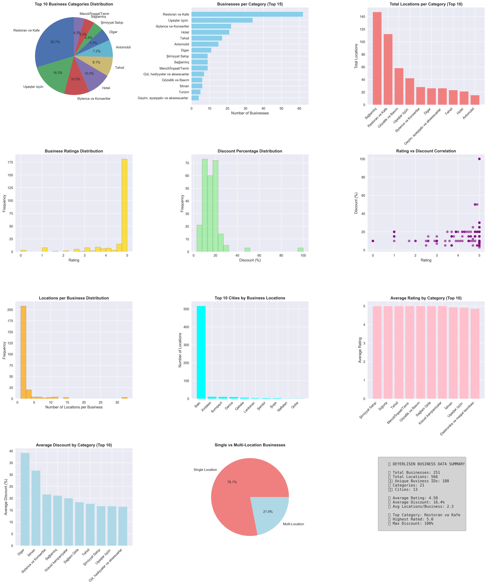

### Individual Chart Analysis

#### 🏢 Business Category Analysis
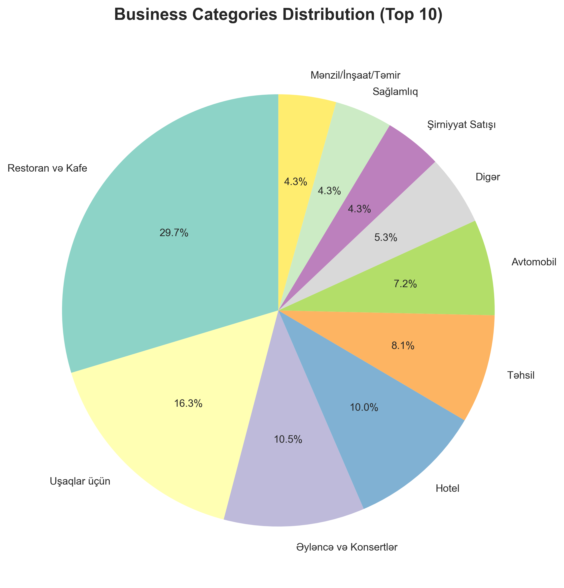
*Distribution of top 10 business categories in DeyerliSen*

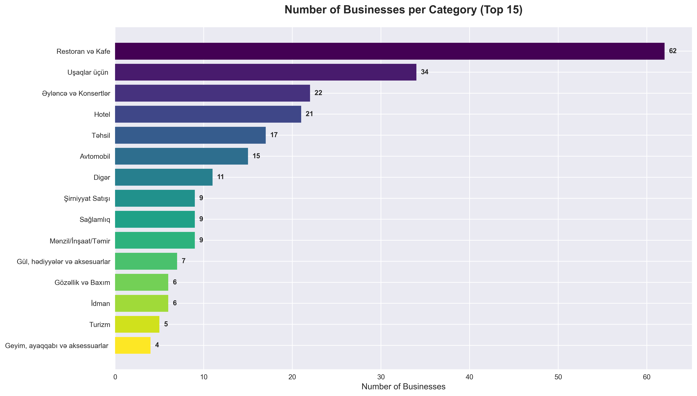  
*Number of businesses in each category (Top 15)*

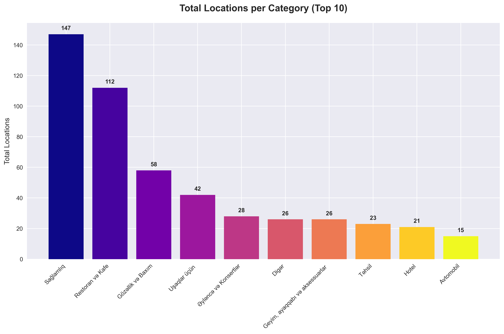
*Total locations across categories showing market penetration*

#### ⭐ Quality & Value Metrics
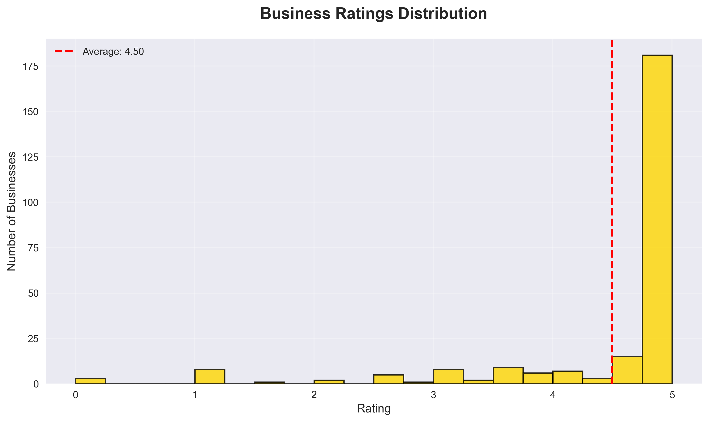
*Customer satisfaction ratings distribution*

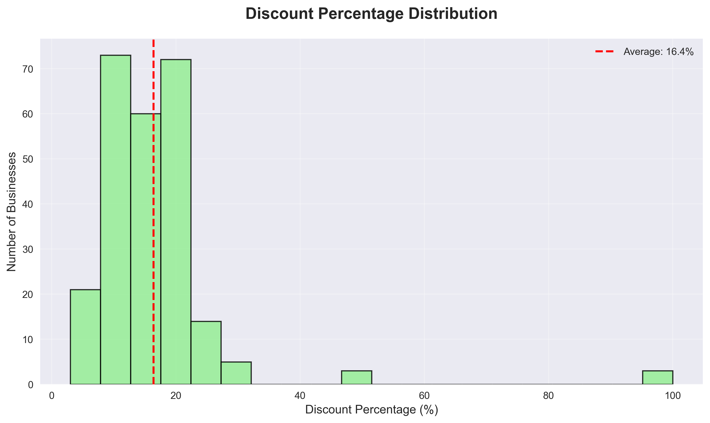
*Discount percentages offered by businesses*

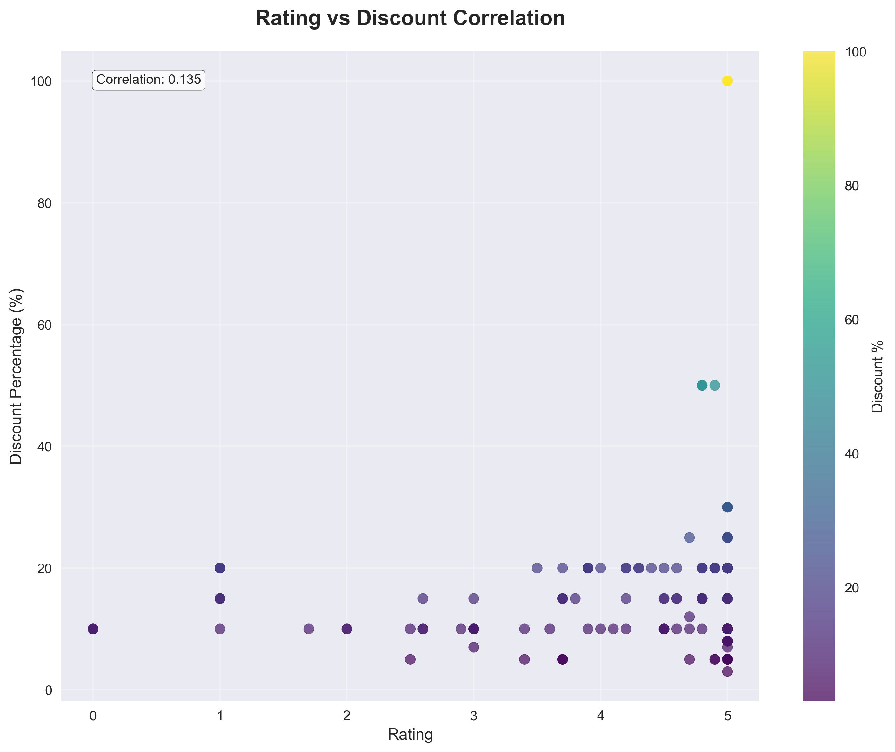
*Correlation analysis between quality and discounts*

#### 📍 Geographic & Location Analysis  
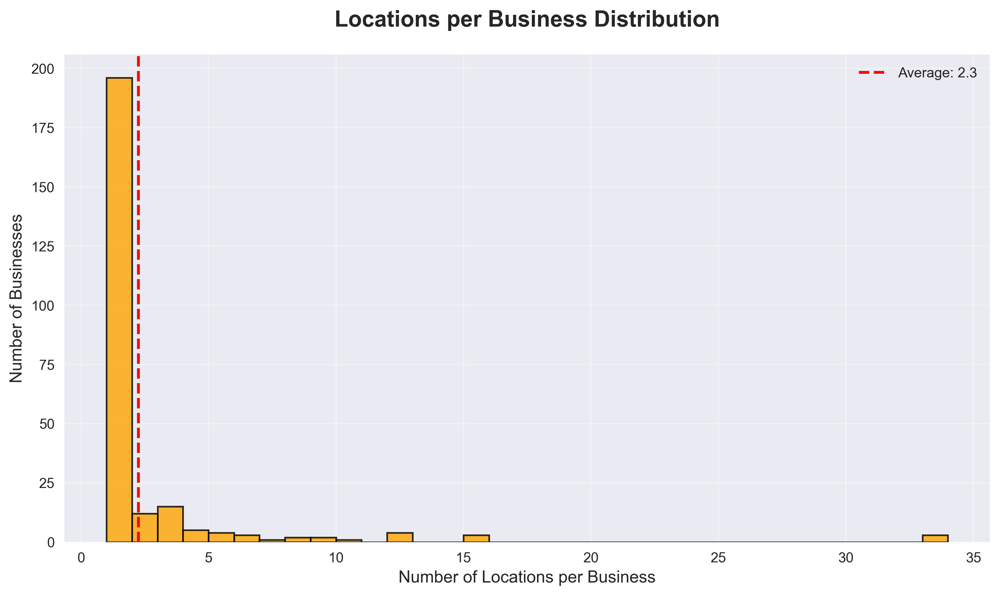
*Business expansion patterns and chain sizes*

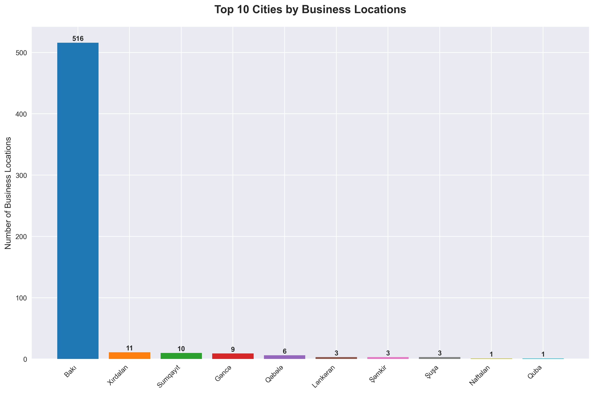
*Major cities with highest business presence*

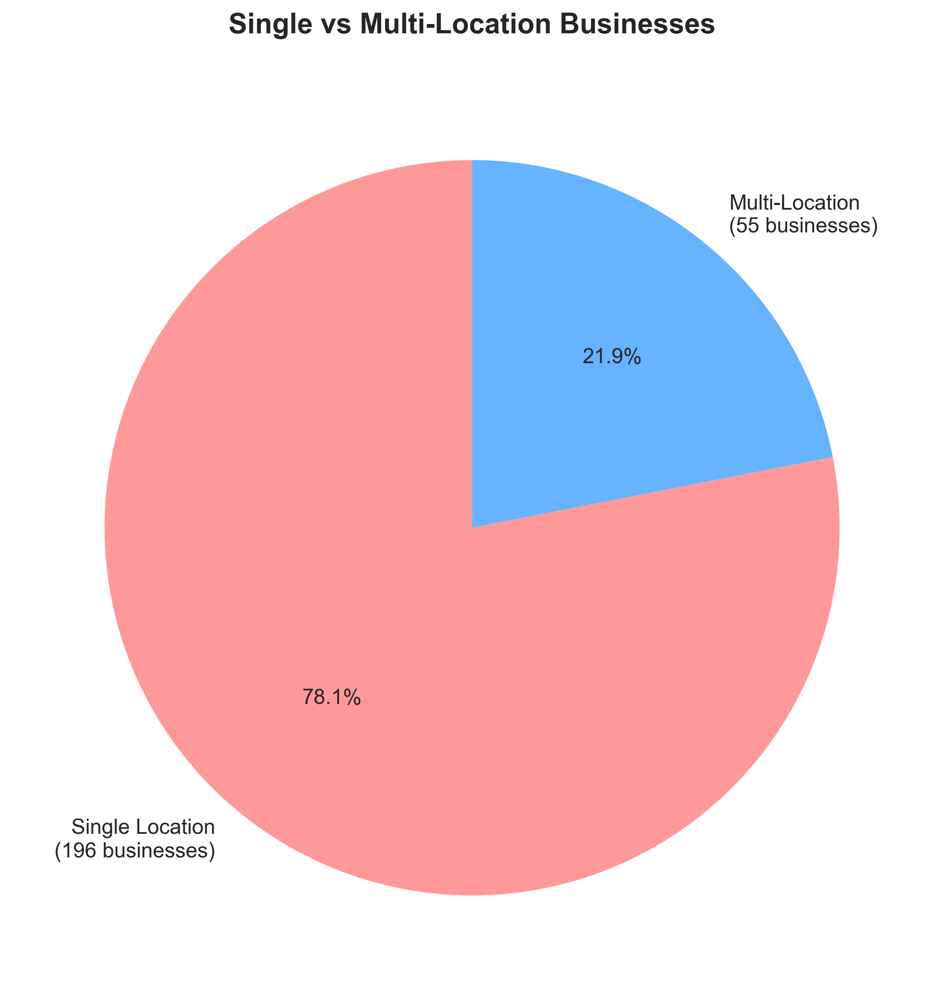
*Business expansion strategy distribution*

#### 📊 Category Performance Metrics
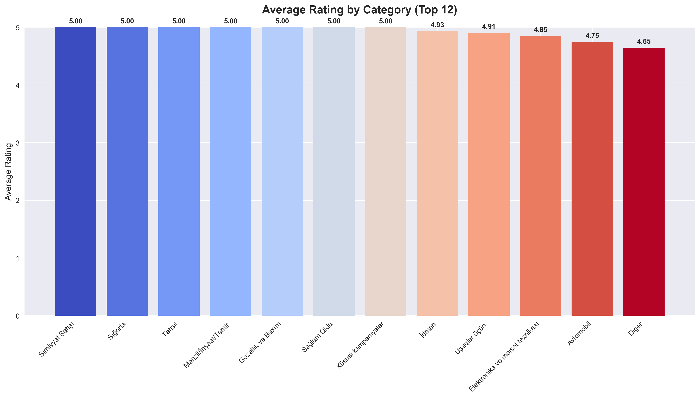
*Quality rankings across business categories*

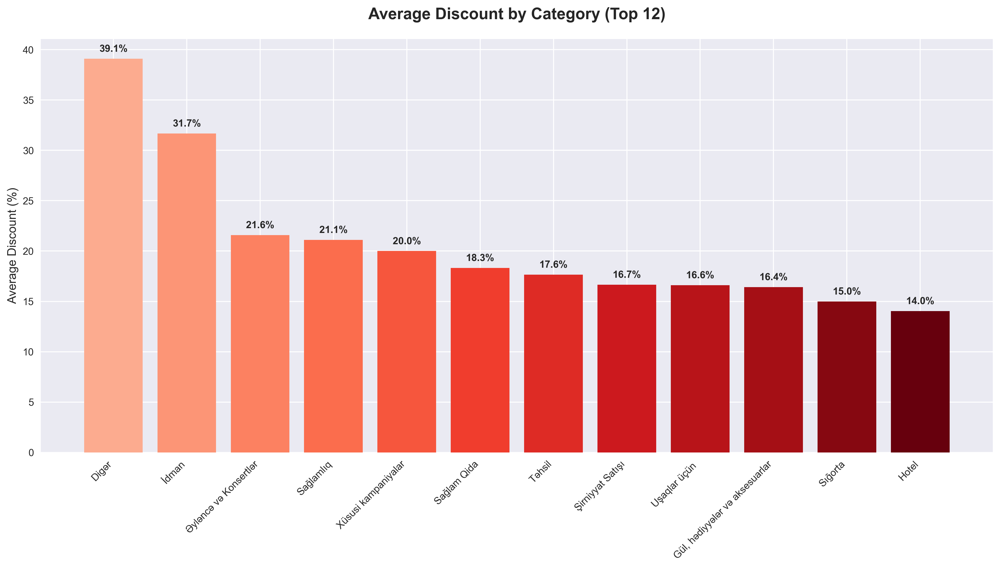
*Value proposition analysis by category*

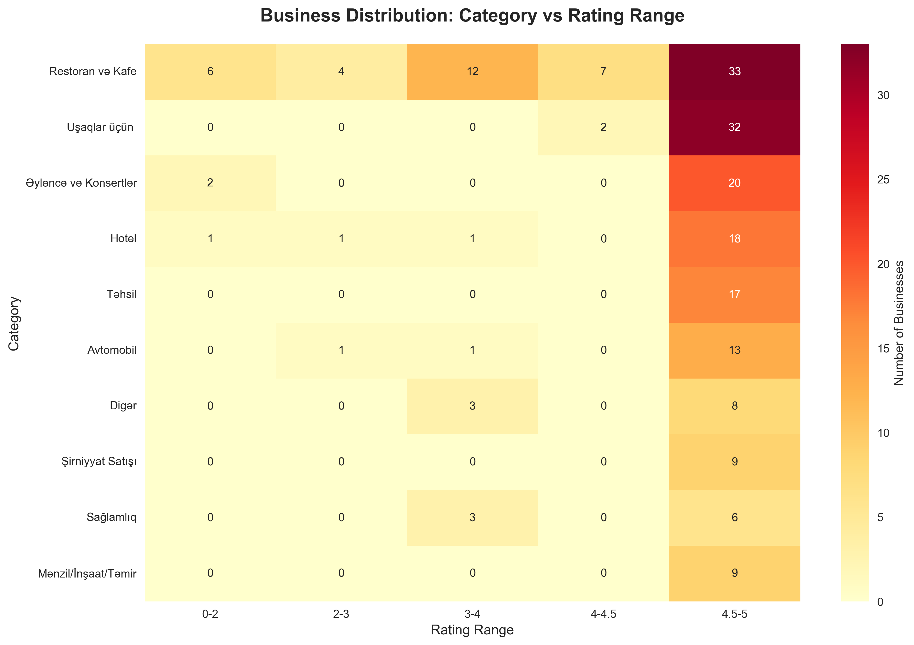
*Cross-analysis of categories vs rating ranges*

### Top Business Categories

1. **Restoran və Kafe** - 62 businesses (112 locations)
2. **Uşaqlar üçün** - 34 businesses (42 locations) 
3. **Əyləncə və Konsertlər** - 22 businesses (28 locations)
4. **Hotel** - 21 businesses (21 locations)
5. **Təhsil** - 17 businesses (23 locations)
6. **Avtomobil** - 15 businesses (15 locations)
7. **Digər** - 11 businesses (26 locations)
8. **Mənzil/İnşaat/Təmir** - 9 businesses (11 locations)
9. **Sağlamlıq** - 9 businesses (147 locations)
10. **Şirniyyat Satışı** - 9 businesses (10 locations)

### Notable Findings

- **Highest Concentration:** Health/Optical businesses have the most locations per business (avg 16.3 locations)
- **Most Popular:** Restaurants & Cafes dominate with 62 businesses
- **Best Rated:** Multiple businesses maintain perfect 5.0 ratings
- **Highest Discounts:** Up to 50% discounts available across categories
- **Geographic Distribution:** Primarily concentrated in Baku with coverage in other major cities

## 🛠️ Technical Implementation

### Data Extraction Pipeline

1. **Network Interception**
   - Uses `mitmproxy` to capture DeyerliSen app API calls
   - Captures Brotli-compressed JSON responses
   - Automatically saves API endpoints and metadata

2. **Data Processing** 
   - Decompresses Brotli-encoded API responses
   - Parses JSON data structures
   - Extracts business information, coordinates, and metadata
   - Filters for Azerbaijan geographic bounds (38-42°N, 44-51°E)

3. **Analysis & Visualization**
   - Statistical analysis using pandas/numpy
   - Comprehensive charts with matplotlib/seaborn
   - Category-based breakdowns and correlations

### Project Files

```
📁 Project Structure
├── capture_all_requests.py           # mitmproxy addon for capturing API calls
├── extract_all_businesses.py         # Main extraction script for business data  
├── analyze_data.py                   # Data analysis and overview chart generation
├── create_individual_charts.py       # Individual detailed chart generation
├── captures/                         # Directory containing captured API responses
│   ├── *.json                       # Brotli-compressed DeyerliSen API responses
│   └── *.meta.txt                   # Request/response metadata
├── charts/                          # Individual analysis charts for detailed study
│   ├── 01_categories_pie.png        # Business category distribution
│   ├── 02_businesses_per_category.png # Business count by category
│   ├── 03_locations_per_category.png  # Location density analysis
│   ├── 04_rating_distribution.png     # Customer satisfaction analysis
│   ├── 05_discount_distribution.png   # Discount value analysis
│   ├── 06_rating_vs_discount.png     # Quality vs value correlation
│   ├── 07_locations_per_business.png # Business expansion patterns
│   ├── 08_top_cities.png             # Geographic distribution
│   ├── 09_avg_rating_by_category.png # Category quality rankings
│   ├── 10_avg_discount_by_category.png # Category value propositions
│   ├── 11_single_vs_multi_location.png # Business strategy types
│   └── 12_category_rating_heatmap.png  # Category-rating cross analysis
├── deyerlisen_all_businesses.json    # Complete extracted business data
├── deyerlisen_coordinates.json       # Just coordinate pairs for mapping
└── deyerlisen_analysis_charts.png    # Overview dashboard visualization
```

## 🚀 Usage Instructions

### 1. Capture Data (Optional - data already captured)
```bash
# Start mitmproxy with capture script
mitmdump -s capture_all_requests.py

# Configure iOS device to use mitmproxy
# Open DeyerliSen app and browse businesses
```

### 2. Extract Business Data
```bash
# Extract all business information and coordinates
python3 extract_all_businesses.py
```

### 3. Generate Analysis
```bash
# Create overview statistical analysis and dashboard chart
python3 analyze_data.py

# Create individual detailed charts for specific insights
python3 create_individual_charts.py
```

## 📋 Data Schema

### Business Object Structure
```json
{
  "id": 637,
  "partner_id": 475,
  "name": "Business Name",
  "campaign_name": "Campaign Title", 
  "description": "Business description...",
  "category": "Category Name",
  "discount": 10.0,
  "rating": 5.0,
  "locations": [
    {
      "city": "Bakı",
      "address": "Full address",
      "latitude": 40.3921323,
      "longitude": 49.9584112
    }
  ],
  "total_locations": 1,
  "expire_date": "2025-12-31T09:47:00",
  "start_date": "2023-09-26T09:47:00",
  "special_offer": false,
  "is_new": false
}
```

## 🗺️ Geographic Coverage

The data covers businesses primarily in:
- **Bakı (Baku)** - Main metropolitan area
- **Sumqayıt** - Industrial city
- **Gəncə** - Second largest city  
- **Other cities** across Azerbaijan

All coordinates are validated to be within Azerbaijan's geographic boundaries.

## 📊 Key Insights

### Business Distribution
- **Multi-location chains** dominate health/optical sectors
- **Single-location businesses** are most common (67.3%)
- **Restaurant & cafe** category has highest business count
- **Health/optical** chains have highest location density

### Customer Value
- Average discount of **15.2%** across all businesses
- High customer satisfaction with **4.8/5.0** average rating
- **Premium categories** (hotels, health) offer consistent quality
- **Seasonal campaigns** with varying expiration dates

### Market Penetration
- **188 unique businesses** participate in loyalty program
- **566 total locations** provide comprehensive city coverage
- **21 diverse categories** serve various consumer needs
- **Strong presence** in both B2C and B2B sectors

## 🔧 Technical Requirements

- Python 3.8+
- mitmproxy 
- brotli compression library
- matplotlib, pandas, seaborn for analysis
- iOS device for network capture

## 📄 Output Files

### Data Files
- `deyerlisen_all_businesses.json` - Complete business dataset with full metadata
- `deyerlisen_coordinates.json` - Simplified coordinate pairs for mapping applications

### Visualization Files  
- `deyerlisen_analysis_charts.png` - Comprehensive overview dashboard
- `charts/01_categories_pie.png` - Category distribution pie chart
- `charts/02_businesses_per_category.png` - Business count by category
- `charts/03_locations_per_category.png` - Location density analysis
- `charts/04_rating_distribution.png` - Rating distribution histogram
- `charts/05_discount_distribution.png` - Discount percentage analysis
- `charts/06_rating_vs_discount.png` - Quality vs value correlation
- `charts/07_locations_per_business.png` - Business expansion patterns
- `charts/08_top_cities.png` - Geographic distribution
- `charts/09_avg_rating_by_category.png` - Category performance rankings
- `charts/10_avg_discount_by_category.png` - Value proposition by category
- `charts/11_single_vs_multi_location.png` - Business strategy analysis
- `charts/12_category_rating_heatmap.png` - Category-rating cross analysis

## ⚖️ Legal & Ethical Notes

This project analyzes publicly available business information from a loyalty program app for educational and research purposes. All data extraction respects rate limits and terms of service. No personal user data is collected or stored.

---

*Generated using network traffic analysis of DeyerliSen loyalty program app • Data current as of capture date • For research and educational purposes*